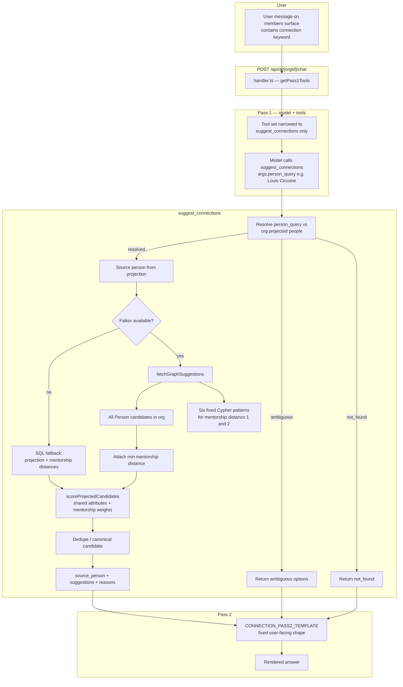

# Falkor connection suggestions — architecture

This document describes how **org-scoped people graphs**, **`suggest_connections`**, and **deterministic scoring** fit together, including **AI chat** routing. For write path, sync, triggers, and troubleshooting, see [Falkor people graph](falkor-people-graph.md).

---

## Mental model

- Every organization gets its own Falkor graph (`teamnetwork_people_<orgId>`).
- Each directory identity is projected into a canonical **`Person`** node (member and alumni rows for the same `user_id` merge in application code before sync and in the read path).
- **`mentorship_pairs`** in Postgres become directed **`MENTORS`** edges between people (by `user_id` / person key rules in `people.ts`).
- **Falkor is mainly used for mentorship reachability:** load all candidate `Person` nodes in the org, then run **fixed Cypher patterns** for mentorship distance **1** and **2** (not a learned ranker in the database).
- The **TypeScript layer** applies the rest of the reasons: shared company, industry, major, graduation year, and city — with **fixed weights** and **deterministic tie-breaks** (`scoring.ts`).

There is **no** fancy learned ranking inside Falkor. The graph supplies **structure** (who exists, mentorship hops); the app supplies **final ranked suggestions**.

---

## Source resolution and `person_query`

For chat, `suggest_connections` can take a natural-language **`person_query`**. The tool matches it against the org’s projected people by **normalized name or email** before ranking candidates.

Resolution outcomes:

- **resolved** — exactly one match; proceed to graph (or SQL fallback) and scoring.
- **ambiguous** — multiple matches; return options for the user to disambiguate.
- **not_found** — no match; return without running graph ranking.

Implementation: `resolveSourceFromQuery()` and the `suggestConnections()` entry in `src/lib/falkordb/suggestions.ts`.

---

## Projection merge (`people.ts`)

`buildProjectedPeople()` merges member and alumni rows that share the same `user_id` into one canonical **`ProjectedPerson`**, picking the best available attributes (e.g. alumni often carry `major`, `industry`, `current_city`). Unlinked rows remain `member:<id>` or `alumni:<id>` person keys.

---

## Falkor read path (`suggestions.ts`)

Once the source person is known:

1. **Fetch all candidate `Person` nodes** in the org (everyone except trivial self-filtering in Cypher).
2. **Run six explicit patterns** for directed mentorship distance 1 and 2 (incoming/outgoing and mixed two-hop shapes), parallelized, and build a **minimum distance** map per candidate `personKey`.

Constants: `MENTORSHIP_DISTANCE_PATTERNS` and `fetchGraphSuggestions()` in `src/lib/falkordb/suggestions.ts`.

---

## Scoring (`scoring.ts`)

The same weights are used in **Falkor mode** and **SQL fallback**:

| Reason | Weight |
|--------|--------|
| `direct_mentorship` | 100 |
| `second_degree_mentorship` | 50 |
| `shared_company` | 20 |
| `shared_industry` | 12 |
| `shared_major` | 10 |
| `shared_graduation_year` | 8 |
| `shared_city` | 5 |

Final score is the **sum** of matching reasons, with deterministic tie-breaking (score → reason count → name → person id). Weights live in `CONNECTION_REASON_WEIGHTS` and per-candidate reasons in `buildSuggestionForCandidate()` (`src/lib/falkordb/scoring.ts`). The orchestration loop that applies them to every candidate is `scoreProjectedCandidates()` in `src/lib/falkordb/suggestions.ts`.

---

## Deduping

If the graph returns multiple rows that map to the **same effective person**, the suggestion pipeline **collapses** them to the strongest canonical candidate (merge mentorship distance and preferred candidate). See the grouping / `preferredCandidate` logic in `src/lib/falkordb/suggestions.ts`.

---

## AI chat: pass 1 and pass 2 (`handler.ts`)

- **Pass 1 tools:** On the **members** surface, if the user message matches a **connection** intent regex, pass 1 exposes **only** `suggest_connections` (narrow tool set so the model must use the tool for grounding).
- **Pass 2 contract:** A fixed **CONNECTION ANSWER CONTRACT** instructs the model how to render results (resolved / ambiguous / not_found / no_suggestions), caps suggestions, and forbids leaking scores, UUIDs, Falkor, or SQL fallback details.

Code: `src/app/api/ai/[orgId]/chat/handler.ts` — `CONNECTION_PROMPT_PATTERN`, `getPass1Tools`, `CONNECTION_PASS2_TEMPLATE`.

---

## SQL fallback

If Falkor is **unavailable** or a **graph query fails**, the implementation falls back to SQL: load the full org projection and mentorship distances (e.g. `get_mentorship_distances` RPC), then run the **same** scoring. The **output shape** stays consistent (`computeSqlFallback` in `suggestions.ts`).

---

## Example flow: “Connections for Louis Ciccone”

---

## Related code (quick index)

| Area | File |
|------|------|
| Projection / person keys | `src/lib/falkordb/people.ts` |
| Suggestions + Falkor queries + fallback | `src/lib/falkordb/suggestions.ts` |
| Reason weights and `buildSuggestionForCandidate` | `src/lib/falkordb/scoring.ts` |
| `scoreProjectedCandidates` (loop + sort + limit) | `src/lib/falkordb/suggestions.ts` |
| Falkor client / availability | `src/lib/falkordb/client.ts` |
| Graph sync worker | `src/lib/falkordb/sync.ts` |
| Chat tool gating and pass 2 | `src/app/api/ai/[orgId]/chat/handler.ts` |

---

## See also

- [Falkor people graph](falkor-people-graph.md) — sync, triggers, graph model, queries, troubleshooting
